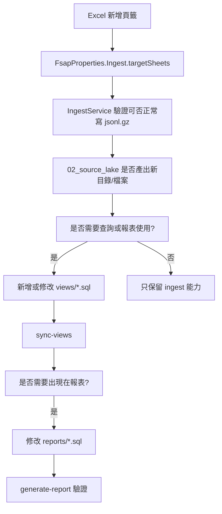
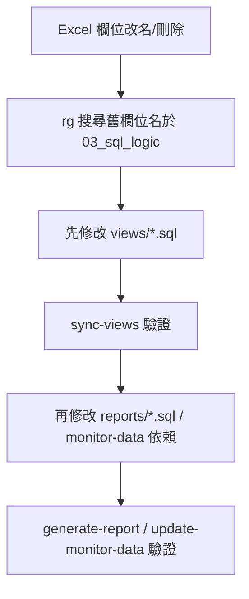
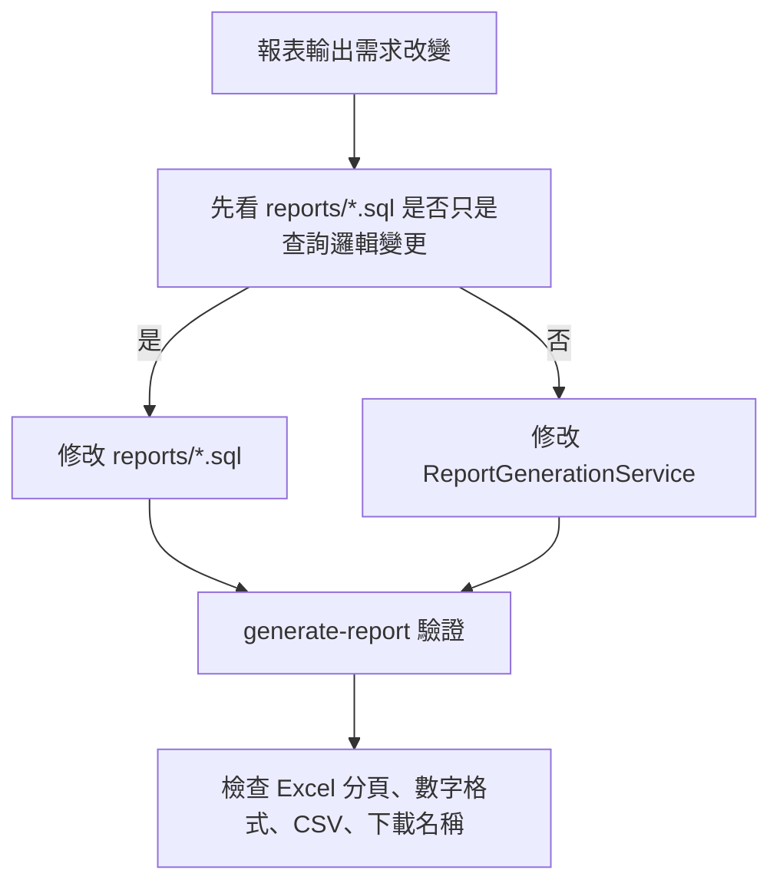
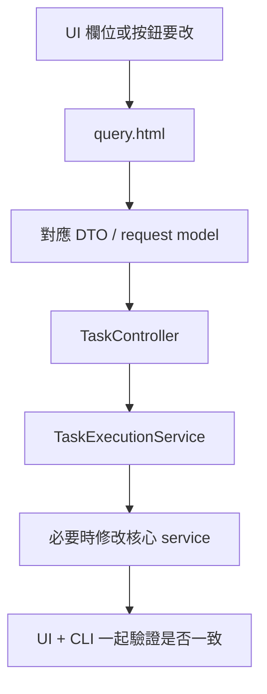

# Java 專案維護與改版指引

更新日期：2026-04-28

本文件的目的不是重講架構，而是讓你在遇到需求變更時，可以快速判斷：

1. 這個需求應該先從哪裡開始改
2. 後面通常還會連動哪些檔案
3. 改完要用什麼方式驗證

如果你只想先看結論，先看第 `2` 節的「情境索引表」。

## 1. 先記住的專案地圖

### 1.1 資料目錄

```text
fsap-month-report-develop/
├── 01_excel_input/        # 原始 Excel
├── 02_source_lake/        # ingest 後的 jsonl.gz
├── 03_sql_logic/views/    # DuckDB views
├── 03_sql_logic/reports/  # 最終報表 SQL
├── 04_report_output/      # Excel / CSV / monitor-data 輸出
├── 05_database/           # DuckDB 檔案
└── logs/                  # ingest / report 執行 log
```

### 1.2 Java 核心入口

| 功能 | 主要入口 |
| :--- | :--- |
| Excel -> jsonl.gz | `src/main/java/com/fsap/monitor/core/ingest/IngestService.java` |
| views 載入 DuckDB | `src/main/java/com/fsap/monitor/core/viewsync/ViewSyncService.java` |
| 產生報表 | `src/main/java/com/fsap/monitor/core/report/ReportGenerationService.java` |
| 報表參數預設 | `src/main/java/com/fsap/monitor/core/report/ReportParameterDefaultsService.java` |
| monitor data 輸出 | `src/main/java/com/fsap/monitor/core/monitor/MonitorDataExportService.java` |
| Web 任務 API | `src/main/java/com/fsap/monitor/web/controller/TaskController.java` |
| 首頁 UI | `src/main/resources/templates/query.html` |
| 系統設定 | `src/main/java/com/fsap/monitor/infra/config/FsapProperties.java` |
| 監控匯出設定 | `config/monitor-data.json` |

## 2. 情境索引表

| 變更情境 | 第一個應先打開的地方 | 常見連動區塊 | 驗證方式 |
| :--- | :--- | :--- | :--- |
| Excel 多一個頁籤 | `FsapProperties.Ingest.targetSheets`、`IngestService` | `02_source_lake/`、`views/*.sql`、`reports/*.sql` | `ingest` -> `sync-views` -> `generate-report` |
| Excel 頁籤改名 / 被移除 | `IngestService`、`FsapProperties.Ingest.targetSheets` | `views/*.sql`、`reports/*.sql` | `ingest` log、`sync-views` |
| Excel 欄位新增 | 該 sheet 對應的 `views/*.sql` | `reports/*.sql`、monitor export | `/api/query` 或 `generate-report` |
| Excel 欄位改名 / 刪除 | `views/*.sql` | `reports/*.sql`、monitor export、Schema 檢查 | `sync-views`、`generate-report` |
| Excel 欄位型別改變 | `IngestService.normalizeCellValue()`、相關 SQL | `reports/*.sql`、數字/日期格式 | `ingest` + `generate-report` |
| Excel 檔名規則變更 | `FsapProperties.Ingest.filenamePattern` | UI 上傳、`ReportParameterDefaultsService` | `ingest --date ...` |
| source lake 路徑 / 檔名規則變更 | `IngestService`、`ProjectPathService` | `views/*.sql` | `sync-views` |
| view SQL 新增 / 修改 | `03_sql_logic/views/*.sql` | 可能有相依 views、monitor export、reports | `sync-views` |
| report SQL 新增 / 修改 | `03_sql_logic/reports/*.sql` | `ReportGenerationService`、排序規則 | `generate-report` |
| 報表月份 / 日期參數規則變更 | `ReportParameterDefaultsService` | `GenerateReportCommand`、`query.html`、`GenerateReportTaskRequest` | CLI + UI |
| monitor-data 新增一張輸出 | `config/monitor-data.json` | 對應 view SQL | `update-monitor-data` |
| UI workflow 順序變更 | `TaskExecutionService` | `query.html` | Web UI 手動操作 |
| 下載檔名 / 輸出位置變更 | `ReportGenerationService`、`FileDownloadController` | UI 下載區 | Web 下載 |
| DuckDB 檔案或資料根目錄搬家 | `FsapProperties.Paths` / 啟動參數 | `doctor`、`serve`、CLI | `doctor` |
| 新增 CLI 命令 | `cli/command/*`、`FsapCli` | 服務層、Web 是否也要做 | `--help` |
| 新增 REST API | `web/controller/*` | DTO、核心 service、UI | `curl` / UI |
| 離線打包 / 依賴變更 | `build.gradle` | 離線 repo 文件 | `bootJar`、`zipOfflineMavenRepo` |

## 3. 維護原則

### 3.1 優先順序

大部分需求都建議照這個順序思考：

1. 原始資料是否變了
2. source lake 是否需要跟著變
3. view SQL 是否還能成立
4. report SQL / monitor export 是否還能成立
5. CLI / UI / 文件是否需要補同步

### 3.2 不要只改表面

例如：

- 只改 UI 欄位，沒改 `TaskController` / `TaskExecutionService`
- 只改 `views/*.sql`，沒檢查 `reports/*.sql`
- 只改 `targetSheets`，沒檢查既有 Excel 是否真的有那個 sheet

這些都很容易讓功能看起來改了，但實際流程跑不通。

## 4. 變更情境詳解

### 4.1 來源 Excel 多一個頁籤

#### 何時會遇到

- 新版本的 Excel 多出一張例如 `NEW_SHEET`
- 你希望這張 sheet 也進入 Java 流程

#### 先改哪裡

1. `src/main/java/com/fsap/monitor/infra/config/FsapProperties.java`
2. `src/main/java/com/fsap/monitor/core/ingest/IngestService.java`

#### 你通常要做的事

1. 把新 sheet 名稱加入 `Ingest.targetSheets`
2. 確認 `IngestService` 對這張 sheet 的欄位型別是否能正常轉 JSON
3. 確認 `02_source_lake/NEW_SHEET/NEW_SHEET-YYYYMMDD.jsonl.gz` 的目錄與檔名是否符合你預期
4. 如果後面要查這張資料，新增或修改 `03_sql_logic/views/*.sql`
5. 如果最後報表要顯示這張資料，再修改 `03_sql_logic/reports/*.sql`

#### 驗證

```bash
java -jar build/libs/fsap-monitor-util-0.1.0-SNAPSHOT.jar \
  --fsap.paths.base-dir=fsap-month-report-develop \
  ingest --date YYYYMMDD
```

看：

- `logs/ingest.log`
- `02_source_lake/NEW_SHEET/`

### 4.2 Excel 頁籤改名或被移除

#### 何時會遇到

- 原本 `MON_LOG` 改名
- 某個 sheet 不再提供

#### 先改哪裡

1. `FsapProperties.Ingest.targetSheets`
2. `IngestService`

#### 連動檢查

- `views/*.sql` 是否仍然引用舊的 source lake 路徑
- `reports/*.sql` 是否仍然依賴由舊 sheet 產生的 view
- `config/monitor-data.json` 是否仍使用相關 view

#### 風險

- 若只改 `targetSheets`，但 SQL 還在查舊資料，`sync-views` 或 `generate-report` 會失敗

### 4.3 Excel 欄位新增

#### 先改哪裡

通常先改 `03_sql_logic/views/*.sql`，因為 ingest 會把新欄位直接寫進 jsonl.gz，真正「讀不讀得到、用不用得到」是在 SQL 層決定。

#### 你通常要做的事

1. 確認 ingest 輸出的 JSON 已含新欄位
2. 修改對應 view，把新欄位帶進來
3. 如果報表要使用，再改 report SQL
4. 如果 schema 頁面要看得出來，就重跑 `sync-views`

#### 驗證

```bash
java -jar ... ingest --date YYYYMMDD
java -jar ... sync-views
java -jar ... serve
```

然後用 `/api/query` 查：

```sql
SELECT * FROM 某個view LIMIT 5;
```

### 4.4 Excel 欄位改名或刪除

#### 這是最常見會炸的地方

因為 ingest 只會照 header 寫 JSON，不會幫你修正 SQL。

#### 先改哪裡

1. 先找出有哪些 views 用到舊欄位
2. 再找出哪些 reports / monitor export 用到那些 views

#### 建議搜尋方式

```bash
rg "舊欄位名" fsap-month-report-develop/03_sql_logic
```

#### 驗證

- `sync-views`
- `generate-report`
- `update-monitor-data`

### 4.5 Excel 欄位型別改變

#### 範例

- 日期欄從 Excel date 變成文字
- 數字欄變成含逗號字串
- 原本整數改成小數

#### 先改哪裡

1. `src/main/java/com/fsap/monitor/core/ingest/IngestService.java`
   - `normalizeCellValue()`
   - `normalizeNumericCell()`
2. 對應的 view SQL / report SQL

#### 判斷原則

- 如果問題發生在「Excel 轉 jsonl.gz」：先看 Java ingest
- 如果 jsonl.gz 正常，但 SQL 轉型失敗：先看 `views/*.sql`

### 4.6 Excel 檔名規則改變

#### 先改哪裡

`src/main/java/com/fsap/monitor/infra/config/FsapProperties.java`

看這個欄位：

- `Ingest.filenamePattern`

目前預設是：

```text
FSAP每日交易統計(\\d{8})\\.xlsx
```

#### 連動

`ReportParameterDefaultsService` 也會根據 ingest 檔名推最近月份，所以檔名規則變更後，預設報表月份推導也要一起驗證。

### 4.7 `02_source_lake` 路徑或命名規則變更

#### 先改哪裡

1. `IngestService`
2. `ProjectPathService`
3. `03_sql_logic/views/*.sql`

#### 為什麼

- ingest 決定輸出到哪裡
- view SQL 決定從哪裡讀
- `ProjectPathService` 會處理專案相對路徑與 glob path

### 4.8 新增或修改 view SQL

#### 先改哪裡

`fsap-month-report-develop/03_sql_logic/views/*.sql`

#### 連動

- 其他相依 views
- `config/monitor-data.json`
- `reports/*.sql`

#### 驗證

```bash
java -jar ... sync-views
```

看：

- `logs`
- UI 的 `Schema Snapshot`
- `/api/query`

### 4.9 新增或修改 report SQL

#### 先改哪裡

`fsap-month-report-develop/03_sql_logic/reports/*.sql`

#### 常見連動

- 若有新 placeholder，需改 `ReportGenerationRequest` / `ReportParameterDefaultsService`
- 若分頁順序要變，檔名前綴要跟著調整
- 若動到 Pivot 類報表，要考慮「無資料月份」時的行為

#### 驗證

```bash
java -jar ... generate-report
```

看：

- `04_report_output/<timestamp>/`
- `report-params.json`
- Excel 分頁順序

### 4.10 報表參數規則變更

#### 範例

- UI 想多一個月份欄位
- CLI 想支援新參數
- `Reporting Month` 的預設推導規則想改

#### 先改哪裡

1. `ReportGenerationRequest`
2. `ReportParameterDefaultsService`

#### 常見連動

- `GenerateReportCommand`
- `GenerateReportTaskRequest`
- `TaskController`
- `TaskExecutionService`
- `query.html`
- `doc/java-report-parameterization-plan.md`

### 4.11 報表 Excel 格式調整

#### 範例

- 數字欄位格式
- 分頁排序
- 空資料頁面如何呈現
- 下載檔名

#### 先改哪裡

`src/main/java/com/fsap/monitor/core/report/ReportGenerationService.java`

#### 常見改動點

- `writeWorkbookSheet()`
- `writeCellValue()`
- `reportFileComparator()`
- workbook 檔名常數

### 4.12 monitor-data 輸出需求變更

#### 先改哪裡

`config/monitor-data.json`

#### 何時要改 Java

- 新 type
- 新輸出格式
- 新欄位轉換規則

這時才需要改：

- `MonitorDataExportService`

#### 驗證

```bash
java -jar ... update-monitor-data
```

### 4.13 UI workflow / 任務順序變更

#### 先改哪裡

1. `TaskExecutionService`
2. `src/main/resources/templates/query.html`

#### 為什麼

- 真正鎖順序的是後端 `TaskExecutionService`
- UI 只是視覺與操作入口

如果你只改 UI 不改後端，仍然可能被 API 順序限制擋住。

### 4.14 新增下載區塊或調整檔案展示

#### 先改哪裡

1. `ArtifactBrowseService`
2. `PageController`
3. `query.html`
4. 必要時 `FileDownloadController`

### 4.15 路徑、base dir、DuckDB 位置變更

#### 先改哪裡

1. `FsapProperties.Paths`
2. 啟動參數 `--fsap.paths.base-dir=...`

#### 驗證第一步

永遠先跑：

```bash
java -jar ... doctor
```

### 4.16 新增 CLI 命令

#### 先改哪裡

1. `src/main/java/com/fsap/monitor/cli/command/`
2. `FsapCli`

#### 連動

- 若 UI 也要做，還要補：
  - `TaskController`
  - `TaskExecutionService`
  - `query.html`

### 4.17 新增 REST API

#### 先改哪裡

1. `web/controller/*`
2. 必要 DTO
3. 核心 service

#### 驗證

```bash
curl http://127.0.0.1:8080/...
```

### 4.18 建置、版本、離線部署需求變更

#### 先改哪裡

1. `build.gradle`
2. `gradle/wrapper/*`
3. 文件：
   - `doc/java-gradle-offline-build.md`
   - `doc/java-startup-and-report-flow.md`

#### 典型情境

- Spring Boot 升版
- 新 dependency
- 離線 repo 打包方式變更
- Windows / Linux 相容性問題

## 5. 目前實際資料流對照

這一節的目的，是讓你在改某個來源時，可以先快速看出：

- 它有沒有被 ingest
- 它有沒有對應 view
- 它目前有沒有被報表或 monitor data 用到

### 5.1 Excel sheet -> source lake -> view -> report / export 對照

| Excel sheet / 來源檔 | source lake / 原始輸入 | 主要 view | 目前實際用途 |
| :--- | :--- | :--- | :--- |
| `RT_CNT` | `02_source_lake/RT_CNT/*.jsonl.gz` | `v_rt_cnt_clean` -> `v_rt_cnt_daily` -> `v_rt_cnt_monthly` / `v_rt_cnt_monthly_no_fac2fas` / `v_rt_cnt_weekly` / `v_rt_cnt_daily_with_tmspt` | **交易量總數主來源**，支撐 `2`、`2.1`、`3` 的峰日判定、`4`、`4.1`、`5`、`5.1`、`6` 的峰日判定、`7`、`7.1`、`7.2` |
| `RT_TMSPT` | `02_source_lake/RT_TMSPT/*.jsonl.gz` | `v_rt_tmspt_clean` | **平均交易時間主來源**，目前直接支撐 `7`、`7.1`、`7.2`，也透過 `v_rt_cnt_daily_with_tmspt` 提供查詢用 |
| `RT_PR_HH24` | `02_source_lake/RT_PR_HH24/*.jsonl.gz` | `v_rt_pr_hh24_clean` | **小時分佈主來源**，支撐 `1`、`3` / `3.1` 的小時分佈、`6` / `6.1` 的峰時分佈、`8` |
| `RT_NODE_HH24` | `02_source_lake/RT_NODE_HH24/*.jsonl.gz` | `v_rt_node_hh24_clean` | 目前主要供查詢與後續擴充，**現行報表未直接使用** |
| `BT_CNT` | `02_source_lake/BT_CNT/*.jsonl.gz` | 目前**沒有對應 view** | 已 ingest，但**現行 Java 報表與 monitor export 未使用** |
| `MON_LOG` | `02_source_lake/MON_LOG/*.jsonl.gz` | `v_prod_monitor_log` -> `v_prod_monitor_daily_count` / `v_prod_monitor_daily_jvm_count` / `v_prod_monitor_hourly_count` / `v_prod_monitor_hourly_jvm_count` | `1.1`、`1.1.1` 報表，以及 `monitor-data` 匯出 |
| `ERR_LOG` | `02_source_lake/ERR_LOG/*.jsonl.gz` | 目前**沒有對應 view** | 已 ingest，但**現行 Java 報表與 monitor export 未使用** |
| `00_info/PR_INFO.csv` | `00_info/PR_INFO.csv` | `v_pr_info` | 支撐 `7`、`7.1`、`7.2`、`8` 的交易名稱 / 類別資訊 |
| `00_info/CFG_PR_INFO.csv` | `00_info/CFG_PR_INFO.csv` | `v_cfg_pr_info` | 已建 view，但**現行報表未直接使用** |
| `00_info/prod_eureka_registry_info.jsonl` | `00_info/prod_eureka_registry_info.jsonl` | `v_prod_eureka_registry_info` | 支撐 monitor 類 views，用來做 application / IP / port 對照 |

### 5.2 view -> report 分頁對照

這一節用來回答「如果某個 view 改了，哪幾個報表最可能一起受影響」。

| view | 主要下游報表 |
| :--- | :--- |
| `v_rt_pr_hh24_clean` | `1`、`3` / `3.1` 的小時分佈、`6` / `6.1` 的峰時分佈、`8` |
| `v_prod_monitor_daily_count` | `1.1`、`1.1.1` |
| `v_pr_info` | `7`、`7.1`、`7.2`、`8` |
| `v_prod_monitor_daily_jvm_count` | 目前無報表直接使用，主要留給 monitor / 查詢 |
| `v_prod_monitor_hourly_count` | 目前無報表直接使用，主要留給 monitor-data |
| `v_prod_monitor_hourly_jvm_count` | 目前無報表直接使用，主要留給 monitor-data |
| `v_prod_monitor_log` | 不直接進報表，透過 monitor 聚合 views 影響下游 |
| `v_rt_cnt_clean` | `2`、`2.1`、`3` 的峰日判定、`4`、`4.1`、`5`、`5.1`、`6` 的峰日判定、`7`、`7.1`、`7.2` |
| `v_rt_cnt_daily*` / `v_rt_cnt_monthly*` / `v_rt_cnt_weekly` | 目前主要留給查詢 / 後續擴充 |
| `v_rt_node_hh24_clean` | 目前無報表直接使用 |
| `v_rt_tmspt_clean` | `7`、`7.1`、`7.2` 的平均處理時間 |

### 5.3 monitor-data 匯出對照

目前 `config/monitor-data.json` 只使用四個 view：

| view | 輸出檔名 | 類型 |
| :--- | :--- | :--- |
| `v_prod_monitor_daily_count` | `daily_data.csv` / `daily_data.js` | `daily` |
| `v_prod_monitor_hourly_count` | `hourly_data.csv` / `hourly_data.js` | `hourly` |
| `v_prod_monitor_daily_jvm_count` | `jvm_daily_data.csv` / `jvm_daily_data.js` | `daily` |
| `v_prod_monitor_hourly_jvm_count` | `jvm_hourly_data.csv` / `jvm_hourly_data.js` | `hourly` |

如果你改的是 monitor 類 view，除了報表外，也要一起檢查這四組輸出。

## 6. 常見需求流程圖

### 6.1 新增 Excel sheet



### 6.2 欄位改名或刪除



### 6.3 報表版面或輸出格式調整



### 6.4 UI 操作方式調整



## 7. 每次改版建議檢查清單

### 5.1 資料面

- Excel 檔名規則有沒有變
- sheet 名稱有沒有變
- header 名稱有沒有變
- 欄位型別有沒有變

### 5.2 SQL 面

- `views/*.sql` 是否仍能建立
- `reports/*.sql` 是否仍能跑
- monitor export 用到的 view 是否仍存在

### 5.3 UI / CLI 面

- CLI `--help` 是否仍正確
- UI 表單欄位是否和後端 request model 同步
- workflow 順序是否仍符合業務流程

### 5.4 產物面

- `02_source_lake` 是否產出正確
- `04_report_output` 是否有 Excel / CSV
- monitor-data 是否正常更新
- 下載檔名 / 路徑是否正常

## 8. 建議驗證順序

當你不確定影響面時，建議固定照這個順序驗證：

1. `doctor`
2. `ingest`
3. `sync-views`
4. `generate-report`
5. `update-monitor-data`
6. `serve`
7. UI 手動檢查

## 9. 快速決策

### 如果你只改原始 Excel 結構

先看：

1. `IngestService`
2. `FsapProperties.Ingest`
3. `03_sql_logic/views`

### 如果你只改報表內容

先看：

1. `03_sql_logic/reports`
2. `ReportGenerationService`
3. `ReportParameterDefaultsService`

### 如果你只改 UI

先看：

1. `query.html`
2. `TaskController`
3. `TaskExecutionService`
4. 對應 DTO / request model

### 如果你只改輸出格式

先看：

1. `ReportGenerationService`
2. `MonitorDataExportService`
3. `FileDownloadController`

## 10. 結論

這個專案的實際維護起點通常只有四個：

1. `IngestService`
2. `03_sql_logic/views/*.sql`
3. `03_sql_logic/reports/*.sql`
4. `ReportGenerationService` / `TaskExecutionService` / `query.html`

判斷方式可以簡化成一句話：

- **資料結構變了，先看 ingest 與 views**
- **查詢邏輯變了，先看 views 與 reports**
- **操作方式變了，先看 request model、TaskController、UI**
- **輸出長相變了，先看 ReportGenerationService / MonitorDataExportService**

如果你之後要我再補第二版，我建議可以再加兩種內容：

1. 每個 sheet / view / report 的「一對一對照表」
2. 針對常見需求的「標準變更流程圖」
