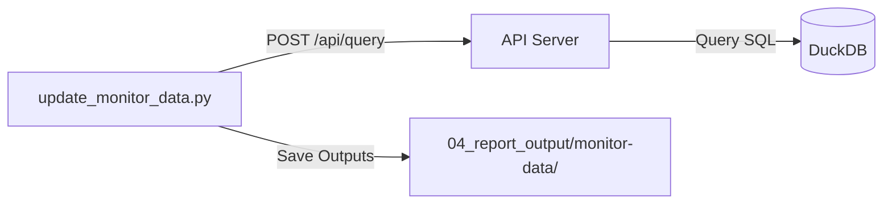

# 監控數據自動更新工具說明 (update_monitor_data)

> 歷史文件：本檔描述 Python 工具透過 REST API 匯出資料的方式。現行 Java `update-monitor-data` 會同步 views 後直接查詢 DuckDB，輸出 CSV 與 JS；請參考 [啟動與產生報表](../../人類操作/啟動與產生報表.md)。

本工具負責自動化維運監控數據的擷取與產出。它透過呼叫系統的 REST API 服務，從 DuckDB 資料庫獲取最新的監控指標，並將資料轉換為 CSV 與 JS 格式，供前端儀表板使用。

## 1. 目錄結構
```text
scripts/update_monitor_data/
├── update_monitor_data.py  # 核心擷取與產出邏輯
└── config.json             # 監控任務配置清單

04_report_output/
└── monitor-data/           # 產出物存放區 (CSV 與 JS)
```

---

## 2. 核心組成

### `update_monitor_data.py`
這是核心執行腳本，採用 **API-First** 架構，具備以下特性：
*   **API 交互**：透過 `POST /api/query` 發送動態 SQL 查詢，解耦資料庫鎖定問題。
*   **動態 SQL 生成**：根據監控類型 (`daily` / `hourly`) 自動計算時間區間，確保資料永遠為「最新的 N 天/小時」。
*   **雙格式產出**：自動輸出 CSV (分析用) 與 JS (網頁嵌入用) 兩種格式。

### `config.json`
定義了監控任務的配置中心：
*   `db_path`: 資料庫位置 (目前由 API Server 統一管理)。
*   `output_dir`: 產出資料存放路徑。
*   `tasks`: 任務列表，定義每個監控 View 對應的產出檔案名稱與類型。

---

## 2. 運作機制



1. **讀取設定**：腳本讀取 `config.json` 中的任務清單。
2. **SQL 生成**：針對每個 View，根據 `daily` (近 10 天) 或 `hourly` (近 4 小時) 的需求，自動補上 `INTERVAL` 過濾條件。
3. **API 查詢**：發送請求至本機的 API Server，API Server 安全地執行查詢並回傳 JSON。
4. **輸出檔案**：將資料儲存為 `.csv` 與 `.js` 檔案，供前端自動化加載。

---

## 3. 維護說明

### 新增監控任務
若未來新增了監控視圖 (如 `v_prod_monitor_node_cpu`)，請按照以下步驟操作：
1. 將視圖定義 SQL 放置於 `03_sql_logic/views/`。
2. 執行 `scripts/update_views_to_db.py` 進行同步。
3. 在 `config.json` 的 `tasks` 清單中新增設定：
   ```json
   {
       "view": "v_prod_monitor_node_cpu",
       "filename": "node_cpu_data",
       "type": "hourly"
   }
   ```
4. 重新執行 `update_monitor_data.py`。

### 執行注意事項
- **API Server**：在執行本腳本前，請確保 API Server 已啟動 (例如：`uvicorn scripts.api_server:app --port 8000`)。
- **除錯紀錄**：執行時，腳本會於終端機輸出 SQL 指令；若發生連線錯誤，請查看 `logs/api_server.log`。

---

## 4. 手動測試 (SQL API)
若需要直接測試 API Server 的查詢能力，可以使用 `curl` 發送 POST 請求：

```bash
curl -X POST http://localhost:8000/api/query \
     -H "Content-Type: application/json" \
     -d '{"sql": "SELECT * FROM v_prod_monitor_daily_count LIMIT 5"}'
```
---

## 5. 產出檔案說明
腳本執行後，會將資料同步產出至 `04_report_output/monitor-data/` 目錄。每個監控任務會產生兩份對應檔案：

| 檔案類型 | 副檔名 | 說明 | 應用場景 |
| :--- | :--- | :--- | :--- |
| **資料檔** | `.csv` | 標準逗號分隔格式，包含完整標頭。 | Excel 離線分析、數據匯入統計工具。 |
| **前端檔** | `.js` | 將 CSV 內容封裝為變數 (如 `const csv_daily_data = ...`)。 | 前端 JS 儀表板直接 `import` 即可載入資料，免去跨域 (CORS) 讀檔問題。 |


### 目錄內容清單
```text
monitor-data/
├── daily_data.js       # 系統資源每日彙整數據
├── hourly_data.js      # 系統資源小時級明細數據
├── jvm_daily_data.js   # JVM 資源每日彙整數據
└── jvm_hourly_data.js  # JVM 資源小時級明細數據

monitor-data/
├── daily_data.csv       # 系統資源每日彙整數據
├── hourly_data.csv      # 系統資源小時級明細數據
├── jvm_daily_data.csv   # JVM 資源每日彙整數據
└── jvm_hourly_data.csv  # JVM 資源小時級明細數據
```

---

## 6. 執行結果範例
當執行 `python3 scripts/update_monitor_data/update_monitor_data.py` 時，終端輸出如下：
...
```text
🚀 開始透過 API 更新監控資料至: 04_report_output/monitor-data

[處理中] v_prod_monitor_daily_count...
  🔍 SQL Query: SELECT *
        FROM v_prod_monitor_daily_count
        WHERE CAST(log_date AS TIMESTAMP) >= (
            SELECT MAX(CAST(log_date AS TIMESTAMP)) FROM v_prod_monitor_daily_count
        ) - INTERVAL 10 DAY
        ORDER BY application, TARGET_IP, log_date DESC
        LIMIT 10000;
  📝 已產出 CSV: daily_data.csv
  🌐 已產出 JS: daily_data.js

[處理中] v_prod_monitor_hourly_count...
  🔍 SQL Query: SELECT *
        FROM v_prod_monitor_hourly_count
        WHERE CAST(log_date AS TIMESTAMP) >= (
            SELECT MAX(CAST(log_date AS TIMESTAMP)) FROM v_prod_monitor_hourly_count
        ) - INTERVAL 4 DAY
        ORDER BY application, TARGET_IP, log_date DESC, log_hour DESC
        LIMIT 10000;
  📝 已產出 CSV: hourly_data.csv
  🌐 已產出 JS: hourly_data.js
```

## 7. 檔案格式:
```text
daily_data.js
const csv_daily_data = `
application,TARGET_IP,log_date,record_count,max_cpu_rate,min_cpu_rate,avg_cpu_rate,max_mem_rate,min_mem_rate,avg_mem_rate,avg_total_mem,max_used_mem,min_used_mem,avg_used_mem,max_disk_rate,min_disk_rate,avg_disk_rate,avg_total_disk,max_used_disk,min_used_disk,avg_used_disk
FAC,10.4.210.141,2026-04-21T00:00:00,18,,,,33.79,33.57,33.66,23779.59,8035.31,7982.42,8005.42,7.35,7.35,7.35,40.39,2.97,2.97,2.97
FAC,10.4.210.141,2026-04-20T00:00:00,144,,,,33.79,33.53,33.6,23779.59,8034.61,7973.53,7990.21,7.35,7.34,7.35,40.39,2.97,2.97,2.97
FAC,10.4.210.141,2026-04-19T00:00:00,143,,,,33.86,33.52,33.58,23779.59,8051.98,7970.0,7986.35,7.34,7.33,7.34,40.39,2.97,2.96,2.96
FAC,10.4.210.141,2026-04-18T00:00:00,144,,,,33.86,33.32,33.55,23779.59,8052.92,7922.42,7977.53,7.33,7.32,7.33,40.39,2.96,2.96,2.96

hourly_data.js
const csv_hourly_data = `
application,TARGET_IP,log_date,log_hour,record_count,max_cpu_rate,min_cpu_rate,avg_cpu_rate,max_mem_rate,min_mem_rate,avg_mem_rate,avg_total_mem,max_used_mem,min_used_mem,avg_used_mem,max_disk_rate,min_disk_rate,avg_disk_rate,avg_total_disk,max_used_disk,min_used_disk,avg_used_disk
FAC,10.4.210.141,2026-04-21T00:00:00,3,1,,,,33.79,33.79,33.79,23779.59,8035.31,8035.31,8035.31,7.35,7.35,7.35,40.39,2.97,2.97,2.97
FAC,10.4.210.141,2026-04-21T00:00:00,2,6,,,,33.77,33.6,33.67,23779.59,8029.85,7989.57,8007.32,7.35,7.35,7.35,40.39,2.97,2.97,2.97
FAC,10.4.210.141,2026-04-21T00:00:00,1,5,,,,33.78,33.57,33.69,23779.59,8033.47,7983.76,8010.89,7.35,7.35,7.35,40.39,2.97,2.97,2.97
FAC,10.4.210.141,2026-04-21T00:00:00,0,6,,,,33.7,33.57,33.62,23779.59,8013.56,7982.42,7993.97,7.35,7.35,7.35,40.39,2.97,2.97,2.97

jvm_daily_data.js
const csv_jvm_daily_data = `
application,TARGET_IP,TARGET_PORT,log_date,record_count,max_used_heap_mem,min_used_heap_mem,avg_used_heap_mem,avg_max_heap_mem,max_max_heap_mem,max_used_heap_mem_rate,min_used_heap_rate,avg_used_heap_mem_rate
FAC,10.4.210.141,8080,2026-04-21T00:00:00,18,5417.05,1369.14,3571.55,8192.0,8192.0,66.13,16.71,43.6
FAC,10.4.210.141,8080,2026-04-20T00:00:00,144,5546.82,650.96,3243.79,8192.0,8192.0,67.71,7.95,39.6
FAC,10.4.210.141,8080,2026-04-19T00:00:00,143,5546.9,658.71,3160.78,8192.0,8192.0,67.71,8.04,38.58
FAC,10.4.210.141,8080,2026-04-18T00:00:00,144,5533.82,645.89,3143.59,8192.0,8192.0,67.55,7.88,38.37

jvm_hourly_data.js
const csv_jvm_hourly_data = `
application,TARGET_IP,TARGET_PORT,log_date,log_hour,record_count,max_used_heap_mem,min_used_heap_mem,avg_used_heap_mem,avg_max_heap_mem,max_max_heap_mem,max_used_heap_mem_rate,min_used_heap_rate,avg_used_heap_mem_rate
FAC,10.4.210.141,8080,2026-04-21T00:00:00,3,1,4149.14,4149.14,4149.14,8192.0,8192.0,50.65,50.65,50.65
FAC,10.4.210.141,8080,2026-04-21T00:00:00,2,6,5413.48,1369.14,3273.26,8192.0,8192.0,66.08,16.71,39.96
FAC,10.4.210.141,8080,2026-04-21T00:00:00,1,5,5417.05,1725.05,3471.62,8192.0,8192.0,66.13,21.06,42.38
FAC,10.4.210.141,8080,2026-04-21T00:00:00,0,6,5385.54,2289.29,3856.84,8192.0,8192.0,65.74,27.95,47.08
```


---
*最後更新日期: 2026-04-20*
