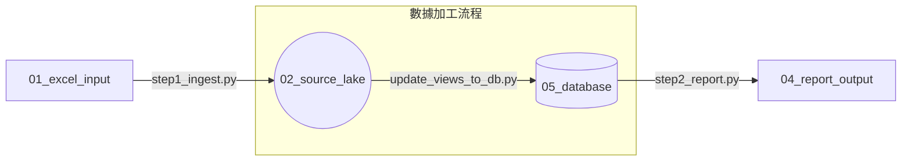

# FSAP 維運月報自動化中心 - 知識庫 (Knowledge Base)

歡迎使用 FSAP 維運月報自動化中心。本文件彙整了所有相關技術手冊與操作指南，協助您快速存取資訊。

> 目前正式操作入口為 Java 版。請優先閱讀 [啟動與產生報表](../../人類操作/啟動與產生報表.md)、[專案維護指引](../../人類操作/專案維護指引.md) 與 [Gradle離線建置](../../人類部署與建置/Gradle離線建置.md)。以下 Python 腳本流程僅保留作為舊版比對與資料回溯參考，不應作為日常執行指令。

## 專案簡介
本專案是一個模組化的自動化維運月報產出系統。它將每日分散的 FSAP 交易統計原始 Excel 資料，透過 **ETL (Extract, Transform, Load)** 流程，轉化為具備分析價值的結構化數據，並最終產出格式化的維運月度報表。

---

## 🛠 核心流程與組件 (Core Workflow)

本系統採用「數據湖」架構，確保原始資料、處理邏輯與最終產出完全解耦：



### 🚀 Step 1: 數據標準化工廠 (`scripts/step1_ingest.py`)
- **功能**：將 `01_excel_input` 中的 Excel 轉化為標準 JSONL 格式。
- **模式**：
    - **增量匯入**：預設模式，自動跳過已處理過的日期，極速補齊缺失資料。
    - **強制重轉**：使用 `--force` 參數，全量重新加工所有原始資料。
- **產出**：存入 `02_source_lake` 分類目錄。

### 👓 View 同步工具 (`scripts/update_views_to_db.py`)
- **功能**：將 `03_sql_logic/views` 中的 SQL 定義持久化寫入實體資料庫。
- **特色**：支援 **「自動重試依賴」** 機制，無需擔心 SQL 視圖之間的引用先後順序。

### 📊 Step 2: 報表產出引擎 (`scripts/step2_report.py`)
- **核心**：連接實體 DuckDB 資料庫，執行 `03_sql_logic/reports` 中的 SQL。
- **產出**：
    - 在 `04_report_output` 依執行時間建立**專屬子目錄** (如 `202604201030`)。
    - 同步產出 **「彙總 Excel 報表」** 與 **「各項 SQL 的獨立 CSV 檔」**。

### 🖥️ 互動查詢儀表板 (`scripts/fsap-month-report-db.py`)
- **定位**：提供維運同仁「自助式」的數據探索與深度分析工具。
- **功能亮點**：
    - **高效能分析**：基於 DuckDB 高效查詢引擎，支援 SQL 探索與多 Tab 獨立查詢。
    - **Excel 完美對接 (V3.3)**：點擊 TSV 格式區塊一鍵複製，欄位自動對齊，無須繁瑣匯出。
    - **結構可視化**：側邊欄自動解析資料庫 Table/View 與欄位型別，方便撰寫 SQL。
    - **持久化回溯**：自動紀錄查詢歷史與各 Tab 的 SQL 內容，關閉後重開自動還原。

---

## 📂 目錄架構說明 (Directory Structure)

本專案已達成 **「零絕對路徑 (Zero Absolute Path)」** 設計，可在任何目錄下移植。

```text
FSAP-Month-Report/
├── 00_info/            # 參考資訊 (PR_ID, Eureka 資訊)
├── 01_excel_input/     # 原料倉：每日統計 Excel
├── 02_source_lake/     # 數據湖：標準化 JSONL 數據
├── 03_sql_logic/       # 邏輯中心：SQL, Views, Report 邏輯
│   ├── views/          # 視圖定義
│   └── reports/        # 報表產出 SQL
├── 04_report_output/   # 成品庫：產出報表 (依時間戳歸檔)
├── 05_database/        # 實體資料庫 (fsap-month-report.duckdb)
├── logs/               # 日誌中心
└── scripts/            # 核心執行腳本 (ingest, report, dashboard)
```

---

## 🏁 快速開始 (Getting Started)

### 1. 環境準備
系統需求：**Python 3.10+** (建議 3.13.x)。
使用一鍵啟動腳本，會自動處理虛擬環境與套件安裝：
```bash
bash scripts/start-fsap-month-report-db.sh
```

### 2. 數據加工流程
```bash
# A. 將 Excel 放入 01_excel_input
# B. 執行數據標準化 (補齊缺失日期)
python3 scripts/step1_ingest.py

# C. 同步 SQL 邏輯至資料庫
python3 scripts/update_views_to_db.py

# D. 產出當月報表
python3 scripts/step2_report.py
```

---

## 📜 日誌管理 (Log Management)
系統所有的運行軌跡皆存放於 `logs/` 目錄：
- `ingest.log`: 數據標準化過程紀錄。
- `view_sync.log`: 資料庫視圖同步紀錄。
- `report_execution.log`: 報表產出引擎紀錄。
- `sql_history.json`: 儀表板 SQL 內容存檔。
- `query_history.log.jsonl`: 儀表板查詢執行歷史。

---

## 📖 相關文件索引
- [**Python 環境安裝**](Python環境安裝.md)：僅供重跑舊版腳本時使用。
- [**Python 資料匯入**](Python資料匯入.md)：舊版 Excel 轉 JSONL 流程。
- [**Python 報表產出**](Python報表產出.md)：舊版 DuckDB 報表產出流程。
- [**Python View 同步**](PythonView同步.md)：舊版 view 載入流程。
- [**Python 監控資料更新**](Python監控資料更新.md)：舊版透過 API 的 monitor 匯出。
- [**FastAPI 服務說明**](FastAPI服務說明.md) 與 [**Streamlit 查詢工具**](Streamlit查詢工具.md)：舊版 Web 元件。
- [**報表 SQL 說明**](../../人類報表與資料/報表SQL說明.md)、[**View SQL 說明**](../../人類報表與資料/ViewSQL說明.md)、[**資料結構說明**](../../人類報表與資料/資料結構說明.md)：目前維護的 SQL 與資料定義。

---
*Last Updated: 2026-04-19*
