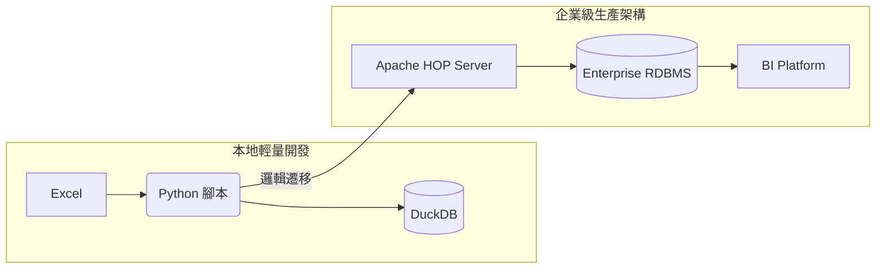

# FSAP 維運月報自動化中心 - 知識庫：自動化工廠 (Local) 到企業級 ETL (PROD) 架構演進

> 架構歷史文件：本檔的 Local 實作描述仍以 Python 為主。現行 Local 實作已改為 Java / Spring Boot / Gradle，但 DuckDB 與 SQL 資產的企業 ETL 遷移方向不變。

歡迎使用 FSAP 維運月報自動化中心。本文件彙整了所有相關技術手冊與操作指南，協助您快速存取資訊。

本文件說明如何將本專案在本地端 (Local) 開發的 **輕量化自動化邏輯**，平滑遷移至企業級生產環境 (PROD) 的 **標準 ETL 架構**。

## 1. 架構演進路線

本專案將開發階段定位為「自動化工廠」，驗證業務邏輯；當報表需求需納入正式維運時，建議將邏輯遷移至企業級 ETL 架構。

## 2. 遷移對應表

| 階段 | 本專案實作 (Local: Python + DuckDB) | 企業級 ETL (PROD: HOP + RDBMS) |
| :--- | :--- | :--- |
| **Ingest** | `step1_ingest.py` (邏輯驗證) | HOP Transformation (生產規格) |
| **Storage** | 本地 `02_source_lake` (JSONL.gz) | ODS (Operational Data Store) 儲存層 |
| **Database** | DuckDB (嵌入式引擎) | Oracle / SQL Server / PostgreSQL |
| **Transform** | `update_views_to_db.py` (開發邏輯) | HOP Job (企業級排程服務) |
| **Reporting** | `step2_report.py` (單機產出) | BI Platform (自動化發布/報表監控) |

## 3. 架構遷移建議

### 🛠 為何開發期選擇輕量化架構？
- **極致的開發彈性**：無需申請資料庫資源，直接修改 SQL 或 Python 即可驗證業務邏輯。
- **邏輯即代碼 (Logic as Code)**：所有處理邏輯皆封裝於 Git 版本控制中，遷移至 PROD 時，邏輯（SQL/Python）可直接轉換為企業級 ETL 組件，無需重新設計。

### 🚀 為何生產環境建議採用傳統 ETL？
- **維運標準化**：PROD 環境需具備高可用性 (HA)、備份與備援能力，傳統 RDBMS 具備完善的企業監控介面。
- **治理與合規**：企業級架構可透過 Apache HOP 與 RDBMS 內建的權限控管 (ACL) 與審計日誌，確保數據存取的安全性與合規性。
- **穩定度與吞吐量**：當資料量從單機級跨入生產級 (Production Scale) 時，HOP 的分散式 ETL 能力與 RDBMS 的索引優化技術，能提供更穩定的運算吞吐量。

---
*結語：本專案的「自動化工廠」設計初衷，正是為了在開發端實現高效率邏輯驗證，並確保最終產出的邏輯能無痛遷移至企業級生產環境。*
